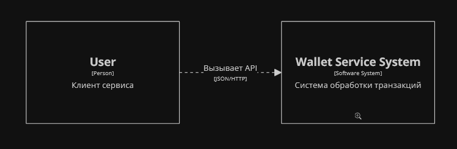
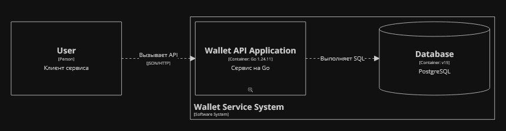
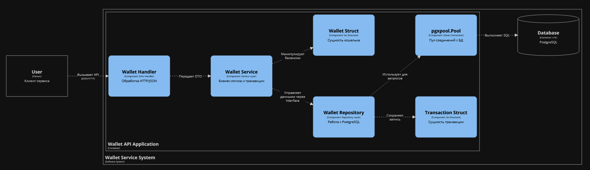
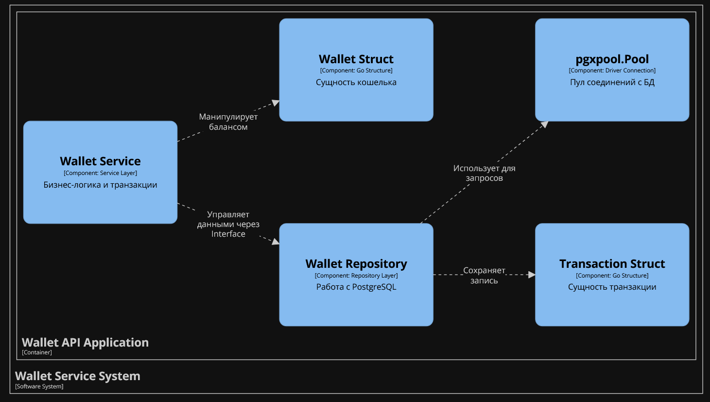

# wallet-service
REST API для управления кошельками на Go с поддержкой транзакций и высоким покрытием тестами.
# 💰 Wallet Test API

Сервис для управления кошельками и проведения транзакций.

## 🚀 Быстрый запуск (Docker)

Для запуска всего окружения (API + PostgreSQL) одной командой:

```bash
docker-compose up --build
```
После этого API будет доступно по адресу: http://localhost:8080/api/v1/wallet

🛠 Технологический стек

    Language: Go 1.24.11

    Database: PostgreSQL 15 (Alpine)

    Driver: pgx/v5 (с использованием пула соединений)

    Environment: godotenv

    Containerization: Docker (Multi-stage build) & Docker Compose

🏗 Архитектура и возможности

    Чистая архитектура: Разделение на слои handler, service, repository и models.

    Безопасность транзакций: Использование SELECT ... FOR UPDATE для предотвращения Race Condition при изменении баланса.

    Валидация: Проверка UUID, типов операций (DEPOSIT/WITHDRAW) и корректности сумм.

    Миграции: Автоматическое создание схем БД при старте контейнера.
    
Level 1 (Context): Кто пользуется системой.



Level 2 (Containers): Из чего система состоит (App + DB).


Level 3 (Components): Как устроено приложение внутри (Handler -> Service -> Repo).


Level 4 (Code): Cтруктуры Wallet и Transaction, а также пул соединений pgxpool.


🧪 Тестирование

Проект покрыт Unit-тестами с использованием моков.

    Service Layer: ~72.7% покрытия.

    Handler Layer: ~37.1% покрытия.

Запуск тестов локально:
Bash

go test ./... -cover

🔌 API Endpoints
1. Проведение операции

POST /api/v1/wallet
JSON

{
"valletid": "UUID",
"operationType": "DEPOSIT или WITHDRAW",
"amount": 1000
}

2. Получение баланса

GET /api/v1/wallets/{WALLET_UUID}
📁 Структура проекта

    cmd/wallet: Точка входа в приложение.

    internal/: Внутренняя логика (бизнес-правила, эндпоинты, БД).

    migrations/: SQL скрипты для инициализации базы данных.

    config.env: Конфигурация окружения (включена в репозиторий согласно ТЗ).
